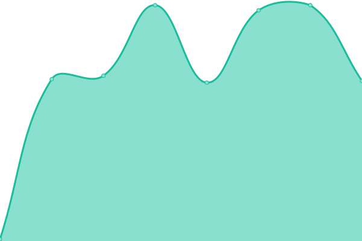
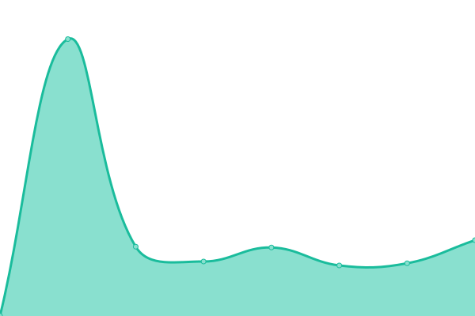

# [📈 Live Status](https://status): <!--live status--> **🟧 Partial outage**

This repository contains the open-source uptime monitor and status page for [Hexagonn](https://status), powered by [Upptime](https://github.com/upptime/upptime).

With [Upptime](https://upptime.js.org), you can get your own unlimited and free uptime monitor and status page, powered entirely by a GitHub repository. We use [Issues](https://github.com/hexaaagon/status/issues) as incident reports, [Actions](https://github.com/hexaaagon/status/actions) as uptime monitors, and [Pages](https://status) for the status page.

<!--start: status pages-->
<!-- This summary is generated by Upptime (https://github.com/upptime/upptime) -->
<!-- Do not edit this manually, your changes will be overwritten -->
<!-- prettier-ignore -->
| URL | Status | History | Response Time | Uptime |
| --- | ------ | ------- | ------------- | ------ |
|  [Web - Main Website](https://main-web-ezl.pages.dev/) | 🟩 Up | [web-main-website.yml](https://github.com/hexaaagon/status/commits/HEAD/history/web-main-website.yml) | 

 146ms
     
 | 

<a href="https://status.hexagonn.my.id/history/web-main-website">100.00%</a>
    

|  [Web - CDN Website](https://cdnsites.hexaa11222474.workers.dev/) | 🟩 Up | [web-cdn-website.yml](https://github.com/hexaaagon/status/commits/HEAD/history/web-cdn-website.yml) | 

 1788ms
     
 | 

<a href="https://status.hexagonn.my.id/history/web-cdn-website">100.00%</a>
    

|  Web - Nginx Proxy Manager | 🟥 Down | [web-nginx-proxy-manager.yml](https://github.com/hexaaagon/status/commits/HEAD/history/web-nginx-proxy-manager.yml) | 

 389ms
     
 | 

<a href="https://status.hexagonn.my.id/history/web-nginx-proxy-manager">50.11%</a>
    

<!--end: status pages-->

[**Visit our status website →**](https://status)

## 📄 License

- Powered by: [Upptime](https://github.com/upptime/upptime)
- Code: [MIT](./LICENSE) © [Hexagonn](https://status)
- Data in the `./history` directory: [Open Database License](https://opendatacommons.org/licenses/odbl/1-0/)
